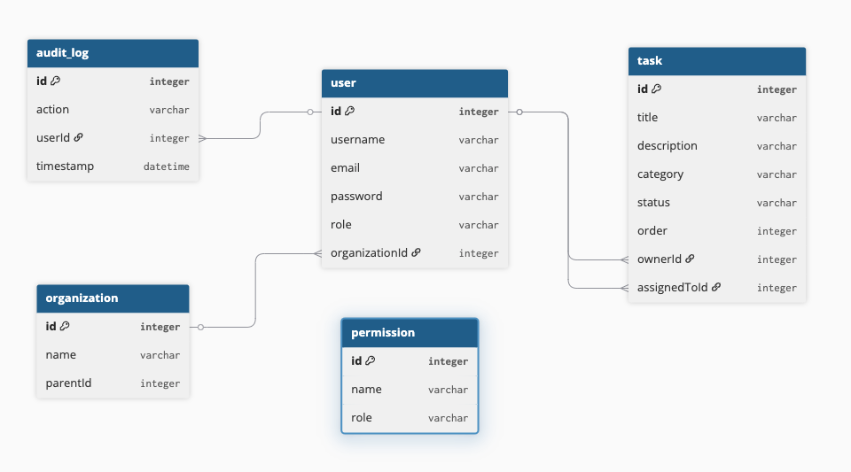

# 📋 Secure Task Management System

A full-stack Secure Task Management System built with **Angular** (frontend) and **NestJS** (backend) in an **NX monorepo**, featuring Role-Based Access Control (RBAC), JWT authentication, and audit logging.

---

## 🗂️ Table of Contents

- [Setup Instructions](#setup-instructions)
- [Architecture Overview](#architecture-overview)
- [Data Model](#data-model)
- [Access Control](#access-control)
- [API Documentation](#api-documentation)
- [Future Considerations](#future-considerations)

---

## ⚙️ Setup Instructions

### Prerequisites

- Node.js 
- NX CLI: `npm install -g nx`
- SQLite (no installation needed — file-based)

### Install

```bash
git clone https://github.com/SachiiR/srosa-3ef166fe-6483-4fba-aae0-c40117e00b29.git
cd STMS
npm install
```

### Environment Configuration

Create a `.env` file in the root directory:

```env
# Database (SQLite - no installation required)
DATABASE_NAME=tasks.db

# JWT
JWT_SECRET=9f3c1a7d4b82e6c0f5d9a3e1c7b4f29d8e6a1c3f4b7d2e9c0a5f1d3b8c6e4a2
```

> **Note:** SQLite is used for development as it is file-based and requires no setup. 

### Running the Applications

**Backend (NestJS API)**
```bash
nx serve api
# Available at http://localhost:3000
```

**Frontend (Angular Dashboard)**
```bash
nx serve dashboard
# Available at http://localhost:4200
```

**Run Both Simultaneously**
```bash
nx run-many --target=serve --projects=api,dashboard
```

### Running Tests

```bash
nx test api                                          # all backend tests
nx test api --coverage                               # with coverage report
nx test api --testFile=auth.service.spec.ts          # single file
```
---

## 🏗️ Architecture Overview

### NX Monorepo Layout

This project uses an NX monorepo — one repository containing multiple apps and shared libraries, eliminating code duplication and ensuring type safety across the full stack.

```
apps/
  api/           → NestJS backend (REST API)
  dashboard/     → Angular frontend

libs/
  data/          → Shared TypeScript interfaces, DTOs, enums (@org/data)
  auth/          → Reusable RBAC guards and decorators (@org/auth)
```

### Shared Libraries

| Library | Import Path | Contents |
|---------|-------------|----------|
| data | `@org/data` | Task, User, Role interfaces, CreateTaskDto, UpdateTaskDto, LoginDto, RoleHierarchy |
| auth | `@org/auth` | RbacGuard, @Roles() decorator |

### Backend Modules

| Module | Responsibility |
|--------|---------------|
| AuthModule | Login, JWT signing, user validation |
| TaskModule | CRUD operations, permission checks, audit logging |
| UserModule | User creation and lookup |
| AuditModule | Logs all task operations with userId and timestamp |

---

## 🗄️ Data Model

### Entities

| Entity | Key Fields | Description |
|--------|-----------|-------------|
| User | id, email, password, role, organizationId | System user with role assignment |
| Task | id, title, category, status, order, ownerId, assignedToId | Task owned and optionally assigned to a user |
| Permission | id, role, name | Maps a role to a permission string e.g. `tasks:create` |
| Organization | id, name | Groups users together for scoped access |
| AuditLog | id, action, userId, timestamp | Immutable log of all task operations |

### Relationships

```


```
Roles are implemented as a TypeScript enum shared across the frontend 
and backend via the `@org/data` shared library, rather than a dedicated 
database table.
```typescript
export enum Role {
  OWNER = 'Owner',
  ADMIN = 'Admin',
  VIEWER = 'Viewer',
}
```

Permissions are stored in the database and mapped to roles using the 
role enum string. This approach keeps the implementation simple while 
still enforcing role-based access control.

A future improvement would be to introduce a dedicated `Role` database 
table with a foreign key relationship to `Permission`, which would allow 
roles to be created and managed dynamically without code changes.

---

## 🔐 Access Control

### Role Hierarchy

| Role | Level | Access |
|------|-------|--------|
| Viewer | 1 | Read and update own/assigned tasks only |
| Owner | 2 | All tasks within their organisation |
| Admin | 3 | All tasks across all organisations |

### Database-Driven Permissions

Permissions are stored in the database as rows mapping a role to a permission string. This means access control can be updated without redeploying the application.

| Permission | Viewer | Owner | Admin |
|------------|--------|-------|-------|
| tasks:create | ❌ | ✅ | ✅ |
| tasks:read | ✅ (own only) | ✅ (org only) | ✅ |
| tasks:update | ✅ (own only) | ✅ (org only) | ✅ |
| tasks:delete | ❌ | ✅ (org only) | ✅ |

### JWT Authentication Flow

1. User logs in with email and password
2. Password verified using `bcrypt.compare` against the stored hash
3. On success, a JWT is signed containing: `email`, `sub` (userId), `role`, `orgId`
4. Token returned to frontend and stored in `localStorage`
5. Every subsequent request includes the token in the `Authorization: Bearer <token>` header
6. `JwtStrategy` verifies the token signature using `JWT_SECRET`
7. Decoded payload attached to `req.user` for use in controllers and services

### RbacGuard — Route Protection

| Route | Required Role | Who Can Access |
|-------|--------------|----------------|
| `POST /tasks` | `@Roles(Role.OWNER)` | Owner and Admin  |
| `GET /tasks` | No guard | Any authenticated user (service handles finer control) |
| `PUT /tasks/:id` | `@Roles(Role.VIEWER)` | All roles (service handles finer control) |
| `DELETE /tasks/:id` | `@Roles(Role.OWNER)` | Owner and Admin |
| `PATCH /tasks/reorder` | `@Roles(Role.VIEWER)` | All roles |

---

## 📡 API Documentation

### Auth Endpoints

| Method | Endpoint | Description |
|--------|----------|-------------|
| POST | `/api/auth/login` | Login and receive JWT token |
| POST | `/api/auth/register` | Register a new user (always Viewer role) |

### Task Endpoints

| Method | Endpoint | Description |
|--------|----------|-------------|
| GET | `/api/tasks` | Get all tasks (scoped by role) |
| POST | `/api/tasks` | Create a new task |
| PUT | `/api/tasks/:id` | Update an existing task |
| DELETE | `/api/tasks/:id` | Delete a task |
| PATCH | `/api/tasks/reorder` | Reorder tasks |

### Sample Requests & Responses

**Login**
```http
POST /api/auth/login
Content-Type: application/json

{
  "email": "admin@org.com",
  "password": "password123"
}
```
```json
{
  "token": "eyJhbGciOiJIUzI1NiIsInR5cCI6IkpXVCJ9..."
}
```

**Create Task**
```http
POST /api/tasks
Authorization: Bearer <token>
Content-Type: application/json

{
  "id":1
  "title":"Get new furniture",
  "description":"Owner 1",
  "category":"Work",
  "status":"Pending",
  "assignedToId":3
}
```

**Forbidden Response**
```json
{
  "statusCode": 403,
  "message": "No permission to delete tasks"
}
```

---

## 🚀 Future Considerations

### Advanced Role Delegation
- Allow Owners to promote Viewers within their organisation without developer intervention
- Implement custom role creation — organisations define their own roles and permissions
- Add resource-level permissions scoped to specific projects or tasks

### JWT Refresh Tokens
Currently tokens have a fixed expiry with no refresh mechanism. A production system would issue:
- Short-lived **access token** (15 minutes)
- Long-lived **refresh token** (7 days)

The frontend would silently exchange the refresh token before expiry.

### CSRF Protection
Moving JWT storage from `localStorage` to `httpOnly` cookies would eliminate XSS risk but would require CSRF protection using the double-submit cookie pattern.

### RBAC Caching
The current `hasPermission()` method queries the database on every request. This can be optimised by:
- Caching permission lookups in Redis with a short TTL
- Loading all permissions into memory at startup and refreshing on change

### Database Migration (SQLite → PostgreSQL)
SQLite is used for development convenience. A production deployment would migrate to PostgreSQL for:
- Concurrent write support
- Connection pooling
- Better performance at scale

TypeORM makes this straightforward — only the datasource config needs updating.

### General Improvements
- Add pagination to `GET /tasks`
- Add `class-validator` decorators on all DTOs for input validation
- Replace `user: any` with a strongly typed `RequestUser` interface throughout
- Add e2e tests covering the full authentication and RBAC flow

---

## 🛠️ Built With

- [NestJS](https://nestjs.com/) — Backend framework
- [Angular](https://angular.io/) — Frontend framework
- [NX](https://nx.dev/) — Monorepo tooling
- [TypeORM](https://typeorm.io/) — Database ORM
- [SQLite](https://www.sqlite.org/) — Development database
- [Passport.js](https://www.passportjs.org/) — Authentication middleware
- [JWT](https://jwt.io/) — Token-based authentication
- [bcryptjs](https://github.com/dcodeIO/bcrypt.js) — Password hashing
- [NgRx](https://ngrx.io/) — Angular state management
